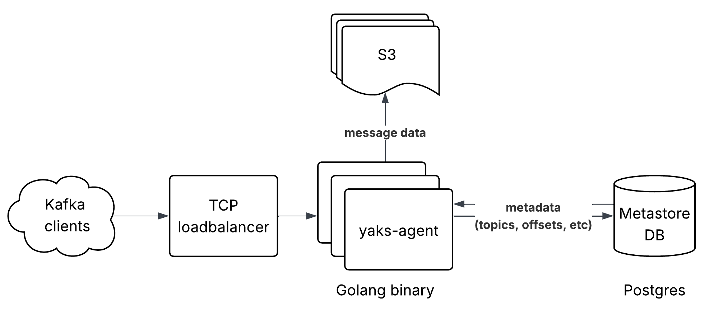
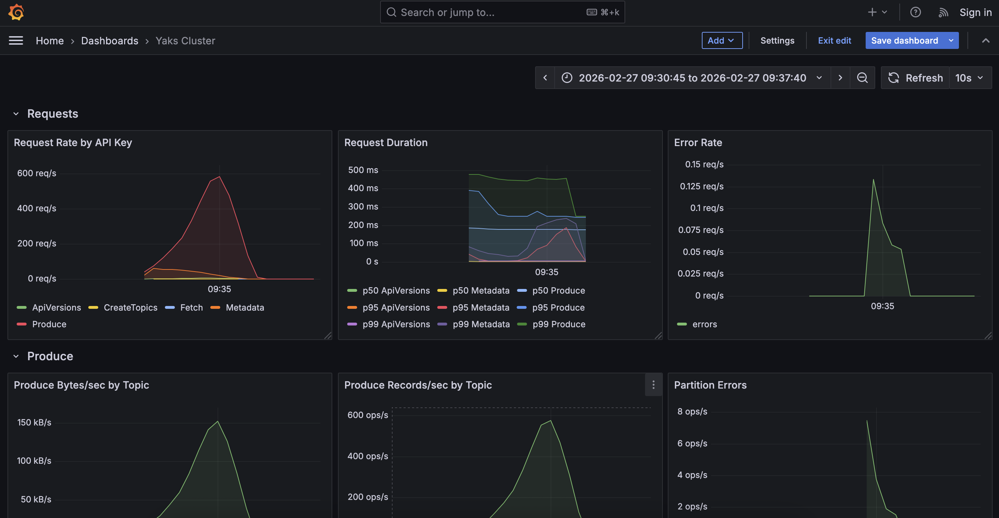

# yaks: harness the power of the herd 🐂

_Kafka-compatible streaming backed by S3 and PostgreSQL._

yaks (**y**et **a**nother **k**afka on **S**3) is a diskless Kafka server that
stores message data directly in S3 and metadata in PostgreSQL. Agents are
completely stateless — scale them horizontally behind a load balancer with no
coordination required. Inspired by [Warpstream](https://www.warpstream.com/) and
[AutoMQ](https://www.automq.com/).

🚧 yaks is a work-in-progress and not production-tested. Use at your own risk.
🚧

<p align="center">
  
</p>

### Why S3?

- **Cheaper storage** — S3 is a fraction of the cost of EBS with high IOPS
- **No disk management** — scale agents up and down without worrying about
  volumes, replication, or rebalancing
- **Painless retention** — keeping topics for 30+ days costs almost nothing

The trade-off is higher end-to-end latency, making yaks a natural fit for
throughput-oriented workloads like log aggregation, event sourcing, and CDC
pipelines.

### Features

- **Kafka wire protocol** — works with existing Kafka clients (franz-go,
  librdkafka, confluent-kafka-go)
- **Stateless agents** — horizontal scaling, no broker state to manage
- **Minimal infrastructure** — just PostgreSQL and an S3-compatible bucket (no
  ZooKeeper, no KRaft)
- **Distributed read cache** — built-in
  [groupcache](https://github.com/mailgun/groupcache) with automatic peer
  discovery to reduce S3 reads
- **Built-in observability** — Prometheus metrics via OpenTelemetry

See the [System Design](./docs/SYSTEM_DESIGN.md) doc for how yaks works.

## Quick Start

Start a two node deployment on your local machine with postgres and localstack.

Both agents are behind an nginx proxy serving on `localhost:9092`:

```bash
docker compose --profile multi-agent up
```

Optionally, run the oracle cli tool to verify data integrity. The oracle
launches concurrent producers, records every message to a local SQLite DB,
consumes all partitions, and checks 6 invariants (completeness, no phantoms, no
duplicate offsets, contiguous offsets, per-producer ordering, and data
integrity):

```bash
go run ./cmd/oracle --brokers localhost:9092
```

Use flags to adjust the workflow:

```bash
go run ./cmd/oracle \
  --brokers localhost:9092 \
  --topics 2 \
  --partitions 3 \
  --producers 50 \
  --records 200 \
  --consume-timeout 120s \
  --data-dir /tmp/oracle-run
```

A metrics dashboard is also serving on
[localhost:3000](http://localhost:3000/d/yaks-cluster/yaks-cluster?orgId=1&from=now-5m&to=now&timezone=browser&refresh=10s).

<p align="center">
  
</p>

## Tests

```bash
# docker daemon is required
# hardcoded infra setup requires running tests serially
go test -p=1 ./...
```

## Project Layout

```
.
├── cmd/
|   ├── agent/          # run yaks-agent
│   └── oracle/         # run oracle for data integrity testing
├── integration/        # integration tests with testcontainers
└── internal/
    ├── agent/          # yaks-agent
    ├── api/            # kafka api logic + serialization
    ├── broker/         # generic kafka broker implementation
    ├── buffer/         # buffer to group messages before upload
    ├── cache/          # groupcache s3 client
    ├── config/         # see config env below for settings
    ├── handlers/       # kafka request handlers
    ├── materializer/   # convert write events to record batches
    ├── metastore/      # store metadata in postgres
    ├── metrics/        # otel metrics
    ├── oracle/         # data integrity testing
    └── s3_client/      # s3 client helper
```

## Configuration

All settings are configured via environment variables prefixed with `YAKS_`.

### Broker

| Variable                       | Default     | Description                                                        |
| ------------------------------ | ----------- | ------------------------------------------------------------------ |
| `YAKS_NODE_ID`                 | `0`         | Unique node identifier                                             |
| `YAKS_BROKER_HOST`             | `0.0.0.0`   | Host address the broker listens on                                 |
| `YAKS_BROKER_PORT`             | `9092`      | Port the broker listens on                                         |
| `YAKS_ADVERTISED_HOST`         | `localhost` | Host advertised to clients in metadata responses                   |
| `YAKS_ADVERTISED_PORT`         | `0`         | Port advertised to clients (falls back to `YAKS_BROKER_PORT` if 0) |
| `YAKS_RUN_MIGRATIONS`          | `false`     | Run database migrations on startup                                 |
| `YAKS_FLUSH_INTERVAL_MS`       | `250`       | Interval (ms) before flushing pending batches to S3                |
| `YAKS_FLUSH_BYTES`             | `5242880`   | Byte threshold before flushing batches to S3                       |
| `YAKS_MATERIALIZE_INTERVAL_MS` | `100`       | Interval (ms) between materializing batches                        |
| `YAKS_MATERIALIZE_BATCH_SIZE`  | `1000`      | Number of records to materialize per batch                         |
| `YAKS_FETCH_MAX_BYTES`         | `52428800`  | Maximum bytes returned in a single fetch response                  |

### PostgreSQL

| Variable           | Default        | Description       |
| ------------------ | -------------- | ----------------- |
| `YAKS_DB_HOST`     | `localhost`    | Database host     |
| `YAKS_DB_PORT`     | `5432`         | Database port     |
| `YAKS_DB_USER`     | `testuser`     | Database user     |
| `YAKS_DB_PASSWORD` | `testpassword` | Database password |
| `YAKS_DB_NAME`     | `testdb`       | Database name     |
| `YAKS_DB_SSLMODE`  | `disable`      | SSL mode          |

### OpenTelemetry

| Variable            | Default | Description                              |
| ------------------- | ------- | ---------------------------------------- |
| `YAKS_OTEL_ENABLED` | `false` | Enable OpenTelemetry metrics             |
| `YAKS_METRICS_PORT` | `9090`  | Port for the Prometheus metrics endpoint |

### S3

| Variable             | Default                 | Description                                         |
| -------------------- | ----------------------- | --------------------------------------------------- |
| `YAKS_S3_ENDPOINT`   | `http://localhost:4566` | S3 endpoint URL                                     |
| `YAKS_S3_REGION`     | `us-east-1`             | AWS region                                          |
| `YAKS_S3_ACCESS_KEY` | `test`                  | Access key ID                                       |
| `YAKS_S3_SECRET_KEY` | `test`                  | Secret access key                                   |
| `YAKS_S3_PATH_STYLE` | `true`                  | Use path-style URLs instead of virtual-hosted-style |
| `YAKS_S3_BUCKET`     | `test-bucket`           | Bucket name for storing message batches             |

### Groupcache

Optional distributed caching layer that reduces S3 reads across multiple agents.

| Variable                          | Default | Description                                              |
| --------------------------------- | ------- | -------------------------------------------------------- |
| `YAKS_GROUPCACHE_ENABLED`         | `false` | Enable groupcache                                        |
| `YAKS_GROUPCACHE_PORT`            | `9080`  | Port for groupcache peer communication                   |
| `YAKS_GROUPCACHE_ADVERTISED_HOST` | `""`    | Host advertised to other groupcache peers                |
| `YAKS_GROUPCACHE_CACHE_SIZE_MB`   | `512`   | Maximum cache size in MB                                 |
| `YAKS_GROUPCACHE_HEARTBEAT_MS`    | `5000`  | Interval (ms) between heartbeats to the metastore        |
| `YAKS_GROUPCACHE_POLL_MS`         | `10000` | Interval (ms) between polling for peer list updates      |
| `YAKS_GROUPCACHE_LEASE_TTL_MS`    | `15000` | TTL (ms) for a node's lease before it is considered dead |

## Supported Kafka API Keys

| API Key         | Min Version | Max Version |
| --------------- | ----------- | ----------- |
| ApiVersions     | 0           | 4           |
| Metadata        | 0           | 7           |
| CreateTopics    | 2           | 4           |
| Produce         | 3           | 3           |
| Fetch           | 3           | 4           |
| FindCoordinator | 0           | 2           |
| ListOffsets     | 1           | 4           |
| OffsetCommit    | 2           | 7           |
| OffsetFetch     | 1           | 5           |

## Related Resources

This project would not be possible without these great resources:

- [Official Kafka protocol guide](https://kafka.apache.org/42/design/protocol/)

- [franz-go](https://github.com/twmb/franz-go): Go library for api message
  serialization - [_Travis Bischel_](https://github.com/twmb)

- [Kafka protocol practical guide](https://ivanyu.me/blog/2024/09/08/kafka-protocol-practical-guide/) -
  [_Ivan Yurchenko_](https://github.com/ivanyu)

- [Warpstream docs](https://docs.warpstream.com/warpstream/overview/architecture)

- [AutoMQ wiki](https://github.com/AutoMQ/automq/wiki/What-is-automq:-Overview)

- [dl.google.com: Powered by Go](https://go.dev/talks/2013/oscon-dl.slide#43) -
  [_Brad Fitzpatrick_](https://github.com/bradfitz)

- [Mailgun fork of groupcache](https://github.com/mailgun/groupcache)
