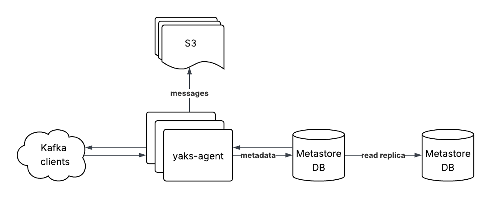

# yaks: Yet Another Kafka on S3

yaks is a kafka compatible server which stores message batches in S3. It is
inspired by similar platforms like [Warpstream](https://www.warpstream.com/) and
[Redpanda](https://www.redpanda.com/).

The system is designed with simplicity in mind. Only a postgres database and S3
bucket are required.

<p align="center">
  
</p>

## Tests

```sh
# docker daemon is required
go test ./...
```

## Project Layout

```
.
├── bin/
│   ├── agent.go    # run yaks-agent
│   └── migrator.go # apply db migrations
└── internal/
    ├── api/         # kafka api logic + serialization
    ├── agent/       # yaks-agent
    ├── broker/      # generic kafka broker implementation
    ├── handlers/    # kafka request handlers
    └── metastore/   # store metadata in postgres
```

## Related Resources

This package would not be possible without these great resources:

- [franz-go](https://github.com/twmb/franz-go): Go library for api message
  serialization - [_Travis Bischel_](https://github.com/twmb)

- [Kafka protocl practical guide](https://ivanyu.me/blog/2024/09/08/kafka-protocol-practical-guide/) -
  [_Ivan Yurchenko_](https://github.com/ivanyu)
