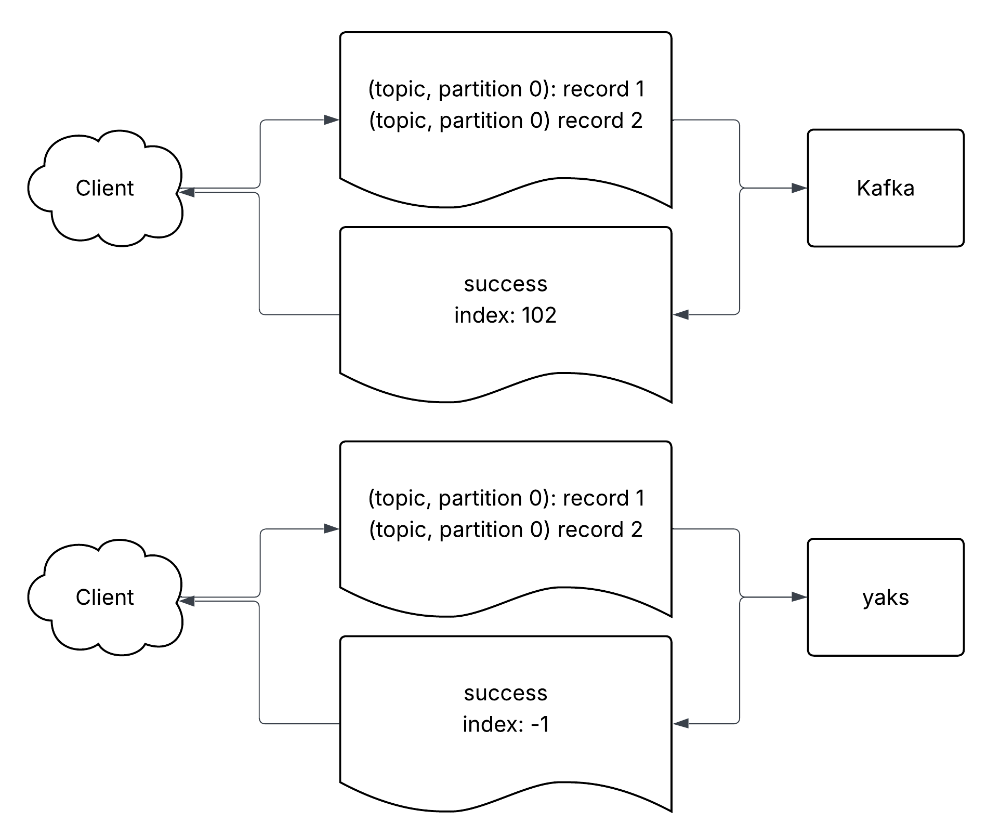
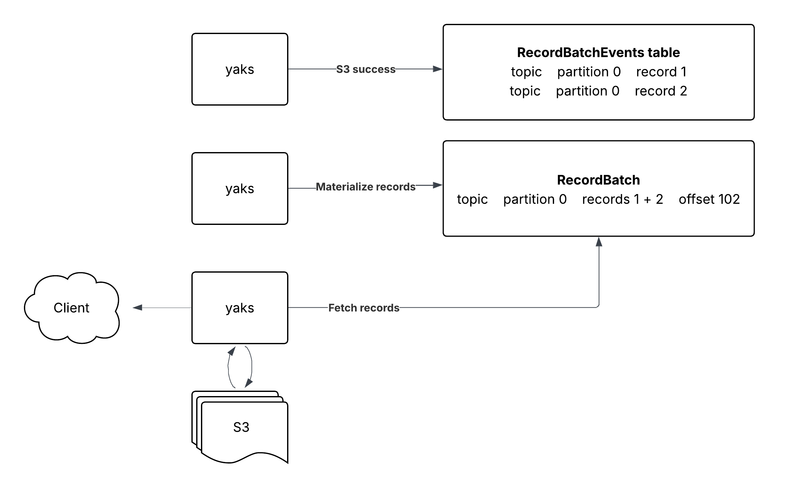

# System Design

**Overview**

Kafka is an event-streaming technology that groups messages into topics, where
each topic can have N partitions. Partitions are ordered, so every message in
the queue is given a permanent offset.

Typically in Kafka-based applications, the producer (client) sends messages to
the broker (server). Upon receiving the data, the broker writes the messages to
disk and returns a success response with the offsets of the data.

In order to improve write throughput, yaks makes a compromise and fails to
return offsets to the producer upon success. Instead, `-1` is returned to
indicate the offset has not been determined yet.

  

This compromise enables yaks to use an
[event sourcing](https://martinfowler.com/eaaDev/EventSourcing.html) model. Upon
receiving a message from the producer, yaks tries to upload the data to S3. If
the upload succeeds, the broker will write a record to Postgres and return
success:

In the background, the broker is also running a materializer job, which is
taking these events and giving them permanent offsets in the partition. These
offsets are then used by the consumers to fetch records from the broker:

When consumers try to fetch more records from the broker, yaks queries Postgres
for the corresponding S3 files. The files are then downloaded, parsed, and a
response is returned:

  

**Pros & Cons**

The beautiful property of this design is that the yaks agent i.e. the kafka
broker is stateless. Nodes can dynamically scale up or down with ease depending
on the traffic requirements.

However, S3 is not free. Pricing depends on storage and the number of API calls:

| Resource                              | Cost per Month |
| ------------------------------------- | -------------- |
| S3 Standard                           | $0.023 / GB    |
| 1,0000 PUT, COPY, POST, LIST requests | $0.0050        |
| 1,0000 GET, LIST requests             | $0.0004        |

In order to make the system cost effect, caching is a required. Additionally,
tuning parameters to ensure each file uploaded to S3 is at least megabytes in
size is recommended. See configuration in README.md for more details.
